# 1. Overview

Restful API for managing tasks assigned to users.

---

# 2. Level of complexity

==BEGINNER==: this version is properly for developer technical skills in the use of the technical stack, it is the foundational part for building projects of more complexity.

---

# 3. Major Releases Timeline

## 0.2.0

- Released on September 2025
- Unit tested
- Spec coverage of 55%

## 0.1.5

- Special features such as rate limiting

---

# 4. Architectural Diagram

## Technology Stack

| Category           | Technologies                                             |
| ------------------ | -------------------------------------------------------- |
| **Core Runtime**   | Node.js ≥20.11.0                                         |
| **Language**       | TypeScript                                               |
| **Framework**      | Express.js                                               |
| **Database**       | MongoDB with Mongoose                                    |
| **Authentication** | JWT-based auth with role-based access control            |
| **Testing**        | Jest with comprehensive unit, integration, and E2E tests |
| **API Design**     | RESTful API with structured response formatting          |

## Complete System Architecture

```mermaid
graph TB
    %% Client Layer
    Client[📱 Client Applications<br/>Frontend/Mobile/API Consumers]

    %% API Gateway & Rate Limiting
    subgraph "🔒 Security & Rate Limiting Layer"
        RL[Rate Limiters<br/>Global/Login/SignUp/User/Supervisor]
        CORS[CORS Middleware]
        Auth[Authorization Middleware]
        Valid[Validation Middleware]
    end

    %% Express Application
    subgraph "🚀 Express Application Layer"
        App[app.ts<br/>Express App Setup]
        Server[server.ts<br/>Application Entry Point]

        subgraph "📍 Route Handlers"
            HCRoutes[Health Check Routes<br/>/healthcheck]
            UserRoutes[User Routes<br/>/users]
            RoleRoutes[Role Routes<br/>/roles]
            TodoRoutes[Todo Routes<br/>/todos]
        end
    end

    %% Controllers Layer
    subgraph "🎮 Controller Layer"
        HCController[Health Check Controller<br/>App & DB Health]
        UserController[User Controller<br/>Auth & User Management]
        RoleController[Role Controller<br/>Role Management]
        TodoController[Todo Controller<br/>Todo Management]
    end

    %% DTO Layer
    subgraph "📦 Data Transfer Objects"
        EndpointDTO[EndpointResponseDto<br/>Standardized API Response]

        subgraph "Response DTOs"
            UserDTO[UsersResponseDTO]
            RoleDTO[RolesResponseDTO]
            TodoDTO[TodosResponseDTO]
            HCDTO[HealthCheckResponseDTO]
            ErrorDTO[ErrorResponseDTO]
        end

        subgraph "Pagination DTOs"
            PaginatedDTO[PaginatedResponseDTO]
        end
    end

    %% Service Layer
    subgraph "⚙️ Business Logic Layer"
        UserService[User Service<br/>Authentication & User Logic]
        RoleService[Role Service<br/>Permission Management]
        TodoService[Todo Service<br/>Todo Operations]
        PaginationService[Pagination Service<br/>Cursor-based Pagination]
    end

    %% Models Layer
    subgraph "🗄️ Data Models Layer"
        UserModel[User Model<br/>Mongoose Schema]
        RoleModel[Role Model<br/>Mongoose Schema]
        TodoModel[Todo Model<br/>Mongoose Schema]
    end

    %% Database
    subgraph "💾 Database Layer"
        MongoDB[(MongoDB<br/>Document Database)]
    end

    %% Utilities
    subgraph "🛠️ Utility Layer"
        Config[Configuration<br/>Environment Variables]
        Seeder[Database Seeder<br/>Initial Data Setup]
        ApiUtils[API Response Utils<br/>Success/Error Helpers]
        JWTUtils[JWT Utilities<br/>Token Management]
    end

    %% Data Flow Connections
    Client -->|HTTP Requests| RL
    RL --> CORS
    CORS --> Auth
    Auth --> Valid
    Valid --> App

    App --> HCRoutes
    App --> UserRoutes
    App --> RoleRoutes
    App --> TodoRoutes

    HCRoutes --> HCController
    UserRoutes --> UserController
    RoleRoutes --> RoleController
    TodoRoutes --> TodoController

    HCController --> HCDTO
    UserController --> UserDTO
    UserController --> EndpointDTO
    RoleController --> RoleDTO
    RoleController --> PaginatedDTO
    RoleController --> EndpointDTO
    TodoController --> TodoDTO
    TodoController --> EndpointDTO

    UserController --> UserService
    RoleController --> RoleService
    TodoController --> TodoService

    UserService --> UserModel
    UserService --> RoleModel
    RoleService --> RoleModel
    TodoService --> TodoModel
    TodoService --> UserModel

    RoleService --> PaginationService

    UserModel --> MongoDB
    RoleModel --> MongoDB
    TodoModel --> MongoDB

    %% Configuration Dependencies
    Config --> App
    Config --> UserService
    Config --> Auth
    Config --> RL

    Seeder --> UserModel
    Seeder --> RoleModel
    Seeder --> TodoModel

    ApiUtils --> UserController
    ApiUtils --> RoleController
    ApiUtils --> TodoController

    JWTUtils --> UserService
    JWTUtils --> Auth

    %% Error Handling
    ErrorDTO --> UserController
    ErrorDTO --> RoleController
    ErrorDTO --> TodoController

    %% Server Setup
    Server --> App

    %% Style definitions
    classDef clientStyle fill:#e1f5fe,stroke:#01579b,stroke-width:2px
    classDef securityStyle fill:#fff3e0,stroke:#e65100,stroke-width:2px
    classDef appStyle fill:#f3e5f5,stroke:#4a148c,stroke-width:2px
    classDef controllerStyle fill:#e8f5e8,stroke:#1b5e20,stroke-width:2px
    classDef serviceStyle fill:#fff8e1,stroke:#f57f17,stroke-width:2px
    classDef modelStyle fill:#fce4ec,stroke:#880e4f,stroke-width:2px
    classDef databaseStyle fill:#e0f2f1,stroke:#004d40,stroke-width:2px
    classDef utilityStyle fill:#f5f5f5,stroke:#424242,stroke-width:2px
    classDef dtoStyle fill:#e3f2fd,stroke:#0d47a1,stroke-width:2px

    class Client clientStyle
    class RL,CORS,Auth,Valid securityStyle
    class App,Server,HCRoutes,UserRoutes,RoleRoutes,TodoRoutes appStyle
    class HCController,UserController,RoleController,TodoController controllerStyle
    class UserService,RoleService,TodoService,PaginationService serviceStyle
    class UserModel,RoleModel,TodoModel modelStyle
    class MongoDB databaseStyle
    class Config,Seeder,ApiUtils,JWTUtils utilityStyle
    class EndpointDTO,UserDTO,RoleDTO,TodoDTO,HCDTO,ErrorDTO,PaginatedDTO dtoStyle
```



## Data Flow Patterns

### 1. Request Processing Flow

```
Client Request → Rate Limiting → CORS → Authorization → Validation → Routes → Controllers → Services → Models → Database
```

### 2. Response Transformation Flow

```
Database → Models → Services → Controllers → DTOs → EndpointResponseDto → Client
```

### 3. Authentication Flow

```
Login Request → UserController → UserService → JWT Creation → Cookie Setting → Response
Protected Route → JWT Verification → Authorization Check → Route Handler
```

### 4. Error Handling Flow

```
Error Occurrence → Service/Controller → ErrorResponseDTO → Standardized Error Response → Client
```

# 5. Technical Specs

## 5.1 Architectural Pattern: MVC

### Core Principles in This Project

- **Modular Design**: Clear separation of routes, controllers, and services
- **Path Aliasing**: Type-safe import aliases for better code organization
- **Comprehensive Testing**: Unit, integration, and E2E test suites
- **Environment Support**: Development and production environment configurations
- **Error Handling**: Consistent error management across the application
- **Database Seeding**: Automated data seeding for development and testing

### Security Features

- CORS protection
- Cookie parsing and security
- Secure authentication flow
- Role-based access control
- Input validation
- Proper error handling without leaking sensitive information

### Architectural Layers

1.  **MVC Pattern**: Clear separation of Models (data), Controllers (request handling), and Views (response formatting)

2.  **Repository Pattern**: Service layer abstracts database operations from business logic

3.  **Dependency Injection**: Controllers receive services as dependencies for better testability

4.  **Factory Pattern**: Used for creating test mocks and configuration objects

5.  **Middleware Pattern**: Composable request processing pipeline for authentication, logging, and error handling

6.  **Singleton Pattern**: Single database connection shared across the application

7.  **Strategy Pattern**: Different response strategies based on HTTP status codes

8.  **Adapter Pattern**: Standardized response format across different API endpoints

9.  **Observer Pattern**: Event-based error logging and request monitoring

### Flow of Control

External requests → Primary Adapters → Primary Ports → Domain Logic → Secondary Ports → Secondary Adapters → External systems

### Core Domain Features

- **Todo Management**: Create, retrieve, update, and delete todos

- **User Management**: User authentication and authorization

- **Role Management**: Role-based access control with granular permissions

- **Health Checks**: API self-monitoring endpoints

---

# 6. API Endpoints

### Health Check Endpoints

- `GET /nodetodo/v1/healthcheck/app` - Application health status
- `GET /nodetodo/v1/healthcheck/db` - Database connectivity check

### User Management Endpoints

- `POST /nodetodo/v1/users/register` - User registration
- `POST /nodetodo/v1/users/login` - User authentication
- `POST /nodetodo/v1/users/logout` - User logout
- `GET /nodetodo/v1/users/list` - List all users (admin)
- `GET /nodetodo/v1/users/me` - Get current user profile
- `PATCH /nodetodo/v1/users/updatedetails` - Update user details
- `PUT /nodetodo/v1/users/updatepassword` - Update user password
- `DELETE /nodetodo/v1/users/delete` - Delete user account

### Role Management Endpoints

- `GET /nodetodo/v1/roles/list` - List roles (paginated)
- `GET /nodetodo/v1/roles/:roleId` - Get specific role
- `POST /nodetodo/v1/roles/new` - Create new role
- `PATCH /nodetodo/v1/roles/:roleId` - Update role
- `DELETE /nodetodo/v1/roles/:roleId` - Delete role

### Todo Management Endpoints

- `GET /nodetodo/v1/todos/list` - List user's todos
- `GET /nodetodo/v1/todos/:todoId` - Get specific todo
- `POST /nodetodo/v1/todos/new` - Create new todo
- `PATCH /nodetodo/v1/todos/:todoId` - Update todo
- `DELETE /nodetodo/v1/todos/:todoId` - Delete todo

---

# 7. Request/Response Format (Domain Translation)

### Task DTO (Data Transfer Object)

```json
{
  "id": 1,
  "title": "Task title",
  "description": "Task description",
  "done": false,
  "owner": 1,
  "created_at": "2023-06-05T10:15:30Z",
  "updated_at": "2023-06-05T10:15:30Z"
}
```

### Success Response (Adapter Translation Layer)

```json
{
  "code": 200,
  "resultMessage": "SUCCESS",
  "data": {
    /* domain object converted to DTO */
  },
  "timestamp": 1686061234,
  "cacheTTL": 30
}
```

### Error Response (Adapter Translation Layer)

```json
{
  "code": 400,
  "resultMessage": "OPERATION_FAILED",
  "error": "Error description"
}
```

# 8. Special features:

## Rate Limiting in Hexagonal Context

- **Cross-cutting Concern**: Implemented as middleware (outside the hexagon)
- **Primary Adapter Extension**: Enhances HTTP handling without touching domain
- **Redis Adapter**: Secondary adapter for distributed rate limiting

## Testing Strategy for Hexagonal Architecture

- **Domain Tests**: Unit tests for core business logic
- **Port Tests**: Tests ensuring port contracts are fulfilled
- **Adapter Tests**: Tests for adapter implementations
- **Mock Ports**: For testing adapters in isolation
- **Integration Tests**: Test full flows through the hexagon

## Benefits of Hexagonal Architecture in This Project

1. **Testability**: Domain logic can be tested without infrastructure
2. **Maintainability**: Clear separation of concerns and dependencies
3. **Flexibility**: Ability to swap out adapters (e.g., change from Redis to another cache)
4. **Focus on Domain**: Business rules are centralized and explicit
5. **Technological Agnosticism**: Core business logic is independent of frameworks

---

# 9. Future Architectural Improvements

- **Domain Events**: Expand event-driven architecture for better decoupling
- **Anti-corruption Layer**: For integrating with external systems
- **Command Query Responsibility Segregation (CQRS)**: Separate read and write models
- **Bounded Contexts**: Define clear boundaries between different domain areas
- Testing strategy needs to be implemented
- Monitoring and observability are missing
- Documentation could be enhanced

---

# 10. Branches

1. ==Main==: it contains the latest deployed and published codebase, this one has been tested against unit, integration and end 2 end, also, there are special directories related to developer such as: devops (CI/CD pipelines), sshots (images for README file) and developer (diagrams, postman yaml files, documentation)

2. ==Stage==: target branch for test the execution of the CI/CD pipelines, includes the interaction with the CI tools and cloud providers, the use of this branch is suggested for QA and DevOps teams. Pre-release version management, this one should be the only one merged with main branch.

3. ==Unstable==: it containts the test codebase (unit, integration, end 2 end), it interacts with experimental and stage branches, must not merge with main.

4. ==Experimental==: alpha version of the codebase, all features are built here, it interacts with unstable and stage, must not be merged directly with main branch.

5. ==Refactor==: special feature requires by Experimental branch, the intention is to not affect the latest run version of the codebase contained in Experimental, if must be merged just with experimental branch.

---

# 11. Leftovers:

- **GraphQL Integration** - Implement GraphQL alongside REST to enable more flexible querying capabilities, reduce over-fetching, and provide a more efficient API interface for complex data requirements.

- **Microservices Architecture** - Consider breaking down the monolithic application into domain-specific microservices (users, todos, roles) for better scalability, team autonomy, and maintainability.

- **Caching Layer** - Implement Redis or another caching solution to improve performance for frequently accessed data and reduce database load.

- **Event-Driven Architecture** - Introduce message queues (RabbitMQ, Kafka) for asynchronous processing and better service decoupling.

- **Observability Stack** - Integrate Prometheus, Grafana, and distributed tracing to gain deeper insights into application performance and behavior.

- **Enhanced Authentication** - Extend the authentication system to support OAuth/OpenID Connect for third-party authentication providers.

- **API Gateway** - Implement an API gateway to handle cross-cutting concerns like rate limiting, request routing, and API versioning.

- **CQRS Pattern** - Separate read and write operations for more complex domains, potentially with different data models optimized for each purpose.

- **Containerization** - Dockerize the application and implement Kubernetes for orchestration to improve deployment consistency and scalability.

- **Domain-Driven Design** - Refactor the code structure to align more closely with business domains, emphasizing ubiquitous language and bounded contexts.

- **Improved Error Handling** - Implement a more robust error handling framework with custom error classes and centralized logging.

- **CI/CD Pipeline** - Establish a comprehensive CI/CD workflow with automated testing, quality gates, and deployment across environments.

- **Serverless Functions** - Consider moving appropriate parts of the application to serverless architecture for improved scalability and cost efficiency.

- Deployment strategy

- **result pattern** - for better error handling
